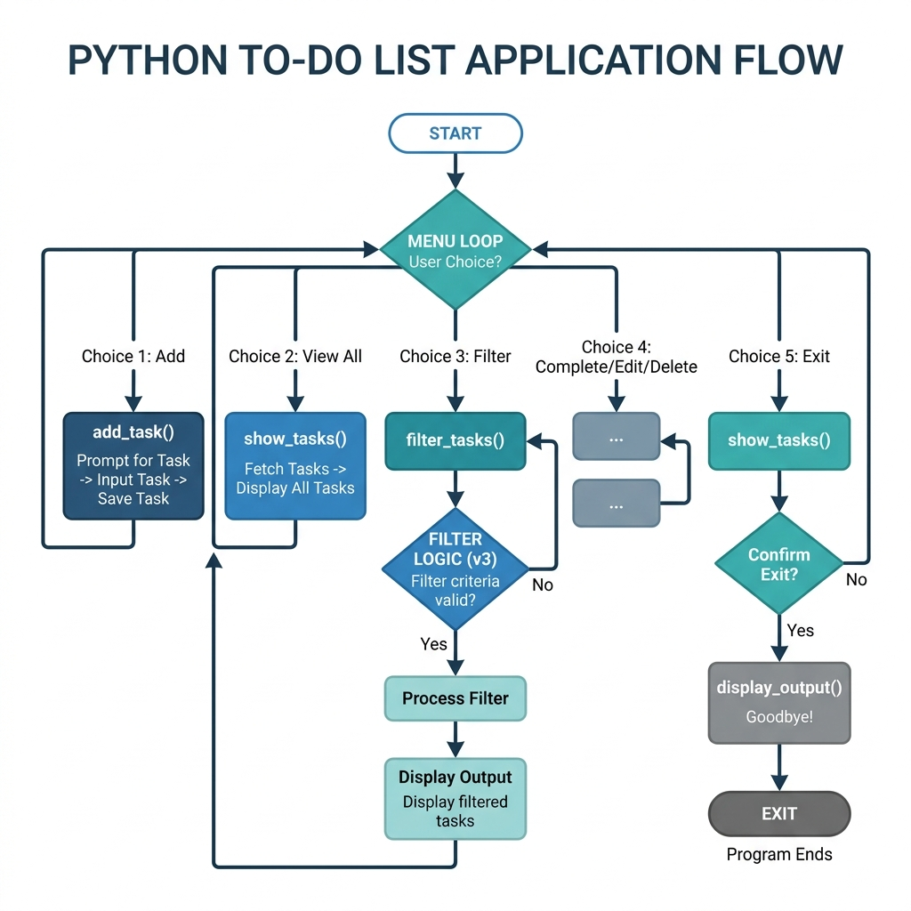
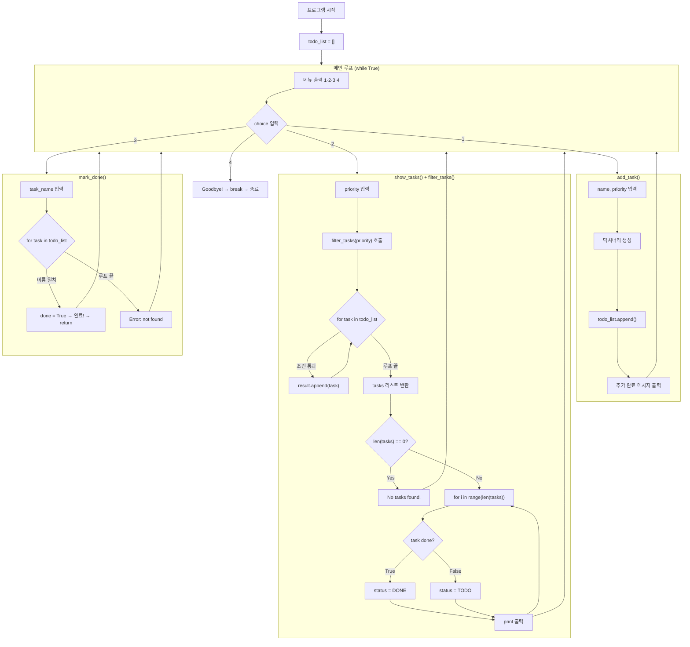

# AP CSP CPT — 코드 단순화 + Rubric 검증 + 학습 플랜

## 📋 버전 이력

| 버전 | 파일 위치 | 특징 |
|------|----------|------|
| v1 | `versions/v1_tkinter_gui/main.py` | tkinter GUI, 84줄, 외부 라이브러리 사용 |
| v2 | `versions/v2_console_simple/main.py` | 콘솔 전환, 55줄, 필터+출력 혼합 |
| **v3** | `main.py` (현재 제출용) | **콘솔, 56줄, 역할 분리로 흐름 명확화** |

---

## 📊 v3 프로세스 비주얼 다이어그램



---

## 1. AI 협업 — 공식 가이드라인 + 커뮤니티 인사이트

### 🏛️ College Board 공식 규정 (2025-2026)

| 항목 | 규정 |
|------|------|
| **AI 도구 사용** | ✅ 허용 — "supplementary resource"로 코딩 원리 이해, 코드 개발, 디버깅 지원 |
| **학생 책임** | 모든 코드를 **리뷰, 이해, 기능 확인**해야 함 |
| **출처 표기** | AI로 생성/공동작성한 코드는 반드시 **citation/attribution** 필요 |
| **표절 처리** | ⛔ 출처 없이 AI 코드 사용 = **표절 → CPT 전체 0점** |
| **PPR 주의** | PPR에 **주석(comment) 포함 절대 금지** → 위반 시 0점 |
| **시험 대비** | End-of-course 시험에서 자신의 코드를 **상세히 설명**할 수 있어야 함 |

### 📢 Reddit/커뮤니티 실제 후기 종합

> [!TIP]
> **커뮤니티 황금 법칙**: *"If you can't explain every line of your code without hesitation, simplify it until you can."*

| 카테고리 | 인사이트 |
|----------|----------|
| 🔴 **가장 큰 리스크** | 시험에서 자기 코드를 설명 못하면 → 0점. Written Response가 핵심 |
| 🟡 **복잡한 코드 = 불리** | 복잡한 코드는 설명 부담 ↑. **단순한 코드가 6/6 최적** |
| 🟢 **단순 = 안전** | To-Do 수준 → 가장 흔하고 안전한 선택 |
| 🟢 **Git 이력** | 커밋 이력 = "내가 직접 발전시킨 코드" 증거 |

---

## 2. v3 핵심 변경: 역할 분리(Separation of Concerns)

### v2의 문제 (필터 + 출력 혼합)
```
show_tasks(filter) 하나가
  → 필터링도 하고
  → 출력도 했음
  → for 루프 안에서 if로 필터 → 흐름이 복잡하고 다이어그램이 꼬임
```

### v3의 해결 (역할 분리)
```
filter_tasks(priority)  → 필터링만 담당, 결과 리스트 반환
show_tasks(priority)    → filter_tasks 호출 후 출력만 담당
```

**개선 효과:**
- 각 함수가 **하나의 일**만 함
- 코드 흐름이 **위에서 아래로 선형**으로 读
- 다이어그램이 자기참조(self-loop) 없이 깔끔

---

## 3. 현재 코드 (v3)

```python
todo_list = []

def add_task(name, priority):
    task = {"name": name, "priority": priority, "done": False}
    todo_list.append(task)
    print("Added: [" + priority + "] " + name)

def filter_tasks(priority):
    result = []
    for task in todo_list:
        if priority == "all" or task["priority"] == priority:
            result.append(task)
    return result

def show_tasks(priority):
    tasks = filter_tasks(priority)
    if len(tasks) == 0:
        print("No tasks found.")
        return
    for i in range(len(tasks)):
        task = tasks[i]
        if task["done"]:
            status = "DONE"
        else:
            status = "TODO"
        print(str(i + 1) + ". [" + task["priority"] + "] " + task["name"] + " - " + status)

def mark_done(task_name):
    for task in todo_list:
        if task["name"] == task_name:
            task["done"] = True
            print(task_name + " marked as done!")
            return
    print("Error: " + task_name + " not found.")

print("=== To-Do List App ===")

while True:
    print("")
    print("1. Add task")
    print("2. Show tasks")
    print("3. Mark task done")
    print("4. Quit")
    choice = input("Choose: ")

    if choice == "1":
        name = input("Task name: ")
        priority = input("Priority (high/medium/low): ")
        add_task(name, priority)

    elif choice == "2":
        priority = input("Filter (all/high/medium/low): ")
        show_tasks(priority)

    elif choice == "3":
        name = input("Task name to mark done: ")
        mark_done(name)

    elif choice == "4":
        print("Goodbye!")
        break
```

---

## 4. Rubric 6 Row 정밀 매칭

### Row 1: Program Purpose and Function ✅
```
Purpose : 할 일(task)을 추가하고 우선순위별로 보고 완료 표시하는 To-Do List
Input   : 메뉴 선택(choice), 할 일 이름(name), 우선순위(priority)
Output  : 할 일 목록 출력, 추가 확인 메시지, 완료 표시 메시지
```

### Row 2: Data Abstraction ✅
- `todo_list`는 **리스트** — 여러 할 일을 순서대로 저장
- 각 항목은 **딕셔너리** — `name`, `priority`, `done` 3개의 key
- `append()`로 새 항목 추가, `for` 루프로 전체 순회

### Row 3: Managing Complexity ✅
> "todo_list 없이 개별 변수를 쓰면, task1_name, task1_priority, task1_done, task2_name... 처럼 할 일 하나당 3개씩 변수가 늘어납니다. 10개 할 일이면 30개 변수가 필요하고, for 루프로 순회할 수도 없습니다. 리스트를 쓰면 append()로 한 줄에 추가하고, for 루프로 한 번에 처리할 수 있어 complexity가 줄어듭니다."

### Row 4: Procedural Abstraction ✅
```python
def filter_tasks(priority):   # ← parameter: priority
```
- `filter_tasks`는 **내가 직접 만든 함수(procedure)**
- `priority` parameter 값에 따라 다른 결과 반환
- `show_tasks`에서 호출되어 전체 기능에 기여

### Row 5: Algorithm Implementation ✅
```
filter_tasks(priority):
  result = []                              # SEQUENCING: 빈 리스트 시작
  for task in todo_list:                  # ITERATION: 전체 순회
      if priority == "all" or ...:        # SELECTION: 필터 조건 확인
          result.append(task)             # SEQUENCING: 조건 통과 시 추가
  return result                           # SEQUENCING: 결과 반환
```
> `for`(iteration) 안에 `if`(selection)이 있고, `result.append` 실행(sequencing) — **3가지 모두 포함**

### Row 6: Testing ✅
| 테스트 | 호출 | 결과 |
|--------|------|------|
| **Call 1** | `show_tasks("all")` | `filter_tasks`가 전체 리스트 반환 → 전부 출력 |
| **Call 2** | `show_tasks("high")` | `filter_tasks`가 high만 반환 → high만 출력 |

---

## 5. 전체 코드 Flow 다이어그램 (v3 — 선형 흐름)



---

## 6. 코드 블록별 Python 학습 가이드

### Block A: 데이터 구조 (Line 1)
```python
todo_list = []
```
| 개념 | 설명 | CSP 용어 |
|------|------|----------|
| 변수 | `todo_list` = 데이터를 담는 상자에 이름표 붙이기 | Variable |
| 빈 리스트 `[]` | 아직 비어 있음. `append()`로 나중에 채움 | Empty List |
| 할당 `=` | 오른쪽 값을 왼쪽 이름에 연결 | Assignment |

---

### Block B: add_task 함수 (Line 3-6)
```python
def add_task(name, priority):
    task = {"name": name, "priority": priority, "done": False}
    todo_list.append(task)
    print("Added: [" + priority + "] " + name)
```
| 개념 | 설명 | CSP 용어 |
|------|------|----------|
| `def` | 함수를 정의(만들기)하는 키워드 | Procedure Definition |
| `name`, `priority` | 함수에 전달하는 값의 이름표 | Parameters |
| `{...}` | 딕셔너리 — key:value 쌍 | Dictionary |
| `False` | 불리언 값 — 참(True) 또는 거짓(False) | Boolean |
| `.append()` | 리스트 끝에 항목 추가 | List Method |

**🗣️ 설명:** "add_task는 할 일 이름과 우선순위를 받아서 딕셔너리를 만들고 todo_list에 추가합니다. done은 처음에 False입니다."

---

### Block C: filter_tasks 함수 (Line 8-13) ⭐ Rubric 핵심 (Row 4, 5)
```python
def filter_tasks(priority):
    result = []
    for task in todo_list:
        if priority == "all" or task["priority"] == priority:
            result.append(task)
    return result
```
| 개념 | 설명 | CSP 용어 |
|------|------|----------|
| `result = []` | 결과를 담을 빈 리스트 생성 | Variable Initialization |
| `for task in todo_list` | 리스트의 각 항목을 하나씩 꺼내서 반복 | Iteration (for loop) |
| `if ... or ...` | 두 조건 중 하나라도 참이면 실행 | Selection (or) |
| `result.append(task)` | 조건 통과한 task만 결과 리스트에 추가 | List Append |
| `return result` | 필터링된 리스트를 호출한 곳으로 돌려줌 | Return Value |

**🗣️ 설명:** "filter_tasks는 priority를 받아서 todo_list에서 조건에 맞는 task만 골라 새 리스트로 반환합니다. 'all'이면 전부, 'high'면 high만 골라냅니다."

---

### Block D: show_tasks 함수 (Line 15-25)
```python
def show_tasks(priority):
    tasks = filter_tasks(priority)
    if len(tasks) == 0:
        print("No tasks found.")
        return
    for i in range(len(tasks)):
        task = tasks[i]
        if task["done"]:
            status = "DONE"
        else:
            status = "TODO"
        print(str(i + 1) + ". [" + task["priority"] + "] " + task["name"] + " - " + status)
```
| 개념 | 설명 | CSP 용어 |
|------|------|----------|
| `filter_tasks(priority)` | 다른 함수를 호출해서 결과를 받음 | Procedure Call |
| `len(tasks)` | 리스트의 항목 개수를 반환 | List Length |
| `range(len(tasks))` | 0부터 개수-1까지 숫자 생성 | Range |
| `tasks[i]` | 인덱스로 특정 항목 꺼내기 | List Indexing |
| `if task["done"]` | 불리언 값으로 조건 판별 | Boolean Selection |
| `str(i + 1)` | 숫자를 문자열로 변환 | Type Conversion |

**🗣️ 설명:** "show_tasks는 filter_tasks를 먼저 호출해서 필터된 리스트를 받습니다. 비어 있으면 'No tasks found.'를 출력하고 끝냅니다. 아니면 반복문으로 각 task를 출력합니다."

---

### Block E: mark_done 함수 (Line 27-32)
```python
def mark_done(task_name):
    for task in todo_list:
        if task["name"] == task_name:
            task["done"] = True
            print(task_name + " marked as done!")
            return
    print("Error: " + task_name + " not found.")
```
| 개념 | 설명 | CSP 용어 |
|------|------|----------|
| `task["done"] = True` | 딕셔너리의 value를 수정 | Dictionary Mutation |
| `return` | 함수를 즉시 종료 | Return (early exit) |
| 마지막 `print` | 루프가 끝까지 돌았는데 못 찾은 경우 | Error Handling |

**🗣️ 설명:** "mark_done은 task_name을 받아 todo_list를 순회합니다. 이름이 일치하면 done을 True로 바꾸고 return으로 끝냅니다. 못 찾으면 에러 메시지를 출력합니다."

---

### Block F: 메인 루프 (Line 34~끝)
```python
while True:
    ...
    choice = input("Choose: ")

    if choice == "1":
        add_task(name, priority)
    elif choice == "2":
        show_tasks(priority)
    elif choice == "3":
        mark_done(name)
    elif choice == "4":
        break
```
| 개념 | 설명 | CSP 용어 |
|------|------|----------|
| `while True` | 무한 반복 — 사용자가 종료할 때까지 | Infinite Loop |
| `input()` | 사용자로부터 텍스트 입력 받기 | User Input |
| `if/elif` | 여러 조건 분기 | Selection / Branching |
| `break` | 반복문을 즉시 탈출 | Loop Termination |
| `add_task(...)` | 앞서 만든 함수를 실행 | Procedure Call |

---

## 7. PPR 준비 가이드

| PPR 항목 | 코드 위치 | 주의사항 |
|----------|-----------|----------|
| **① Procedure 정의** | `def filter_tasks(priority):` 전체 | 주석 없이 |
| **② Procedure 호출** | `tasks = filter_tasks(priority)` (show_tasks 안) | 호출부만 캡처 |
| **③ List 생성/저장** | `todo_list = []` + `todo_list.append(task)` | 저장 코드 |
| **④ List 사용** | `for task in todo_list:` (filter_tasks 안) | 활용 코드 |

> [!CAUTION]
> - PPR에 **주석(#)이 절대 포함되면 안됨** → 위반 시 CPT 전체 0점
> - 제출 전 주석 모두 제거 후 스크린샷
> - 폰트 **10pt 이상** 확인

---

## 8. Written Response 시험 대비 모의 답변

### Q1: Program Purpose and Function
> "이 프로그램의 purpose는 할 일 목록을 관리하는 To-Do List입니다. 사용자는 메뉴 번호를 입력(input)하고 할 일 이름과 우선순위를 입력합니다. 프로그램은 할 일 목록을 출력(output)하고 추가, 완료 상태를 표시합니다."

### Q2: Data Abstraction
> "todo_list는 여러 할 일을 하나의 리스트로 관리합니다. 리스트 없이 개별 변수를 쓰면 task1_name, task1_priority, task1_done, task2_name... 처럼 할 일 하나당 3개씩 변수가 필요합니다. 리스트를 쓰면 append()로 쉽게 추가하고, for 루프로 한 번에 처리할 수 있어 complexity가 줄어듭니다."

### Q3: Procedural Abstraction
> "filter_tasks 함수는 priority라는 parameter를 가집니다. 'all'을 전달하면 전체 리스트를, 'high'를 전달하면 high 우선순위만 골라 반환합니다. 이 함수 덕분에 show_tasks는 필터링 로직을 직접 작성하지 않아도 됩니다."

### Q4: Testing
> "Call 1: show_tasks('all') — filter_tasks가 todo_list 전체를 반환하여 모든 task가 출력됩니다. if 조건 `priority == 'all'`이 True이므로 for 루프의 모든 task가 result에 추가됩니다.
> Call 2: show_tasks('high') — filter_tasks가 priority가 'high'인 task만 반환합니다. `task['priority'] == priority` 조건이 True인 task만 result에 추가되어 high 항목만 출력됩니다. 두 호출은 같은 함수지만 다른 argument로 다른 결과를 냅니다."
