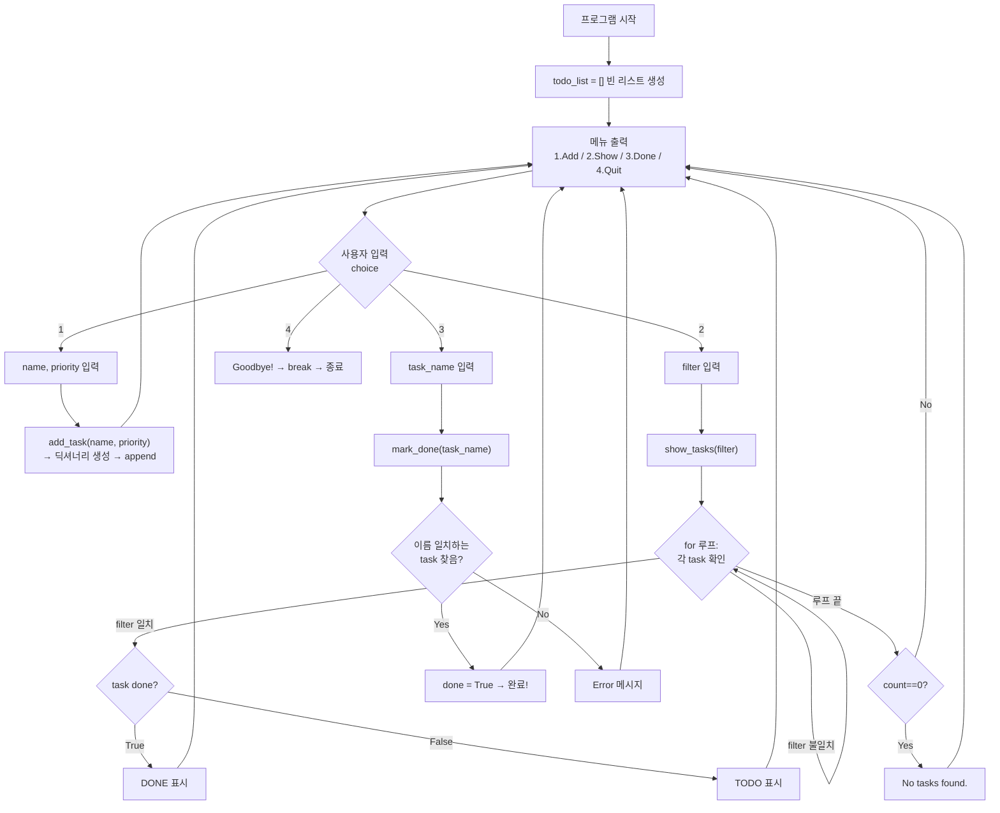

# AP CSP CPT — 코드 단순화 + Rubric 검증 + 학습 플랜

## 📋 현재 상태 분석

### 현재 코드: `main.py` (To-Do List, tkinter GUI, 84줄)
현재 Jack의 리포에는 **tkinter GUI 기반 To-Do 리스트** 앱이 있음.

> [!WARNING]
> **문제점**: 현재 코드는 tkinter GUI 코드가 절반 이상을 차지하고, GUI 위젯 코드는 rubric 검증이나 시험 설명에서 불필요한 복잡성을 추가함. **콘솔 버전으로 단순화**하면 rubric 핵심에만 집중 가능.

| 현재 (GUI) | 제안 (Console) |
|------------|----------------|
| 84줄 (절반이 GUI 코드) | **~50줄** (순수 로직만) |
| `tkinter` import/위젯 설명 부담 | `input()`/`print()`만 사용 |
| GUI 위젯 배치 코드 설명 불필요 | **모든 줄을 설명 가능** |
| Radiobutton, Frame 등 시험에 안 나옴 | CSP 수업 범위 내 문법만 사용 |

---

## 1. AI 협업 — 공식 가이드라인 + 커뮤니티 인사이트

### 🏛️ College Board 공식 규정 (2025-2026)

| 항목 | 규정 |
|------|------|
| **AI 도구 사용** | ✅ 허용 — "supplementary resource"로 코딩 원리 이해, 코드 개발, 디버깅 지원 |
| **학생 책임** | 모든 코드를 **리뷰, 이해, 기능 확인**해야 함 |
| **출처 표기** | AI로 생성/공동작성한 코드는 반드시 **citation/attribution** 필요 |
| **표절 처리** | ⛔ 출처 없이 AI 코드 사용 = **표절 → CPT 전체 0점** |
| **PPR 주의** | PPR(Personalized Project Reference)에 **주석(comment) 포함 절대 금지** → 위반 시 0점 |
| **시험 대비** | End-of-course 시험에서 자신의 코드를 **상세히 설명**할 수 있어야 함 |

### 📢 Reddit/커뮤니티 실제 후기 종합

> [!TIP]
> **커뮤니티 황금 법칙**: *"If you can't explain every line of your code without hesitation, simplify it until you can."*

| 카테고리 | 인사이트 | 출처 |
|----------|----------|------|
| 🔴 **가장 큰 리스크** | 시험에서 자기 코드를 설명 못하면 → 0점 위험. Written Response가 핵심 | r/APStudents, r/apcsp |
| 🔴 **스타일 불일치** | 수업 중 실력과 제출 코드의 퀄리티 격차가 크면 교사가 의심 & 보고 | r/APStudents |
| 🔴 **AI 탐지** | CB는 표절탐지 도구 사용 + 교사 보고 시스템 + interim work 요청 가능 | collegeboard.org |
| 🟡 **복잡한 코드 = 불리** | 복잡한 코드는 설명 부담 ↑, 실수 리스크 ↑. **단순한 코드가 6/6 최적** | Reddit 합의 |
| 🟢 **단순 = 안전** | Quiz, Budget tracker, To-do 수준 → 가장 흔하고 안전한 선택 | r/apcsp |
| 🟢 **Git 이력** | 커밋 이력 = "내가 직접 발전시킨 코드" 증거. **현재 리포 있으므로 유리** | Reddit 다수 |
| 🟢 **AI를 "튜터"로** | AI에게 "이 코드가 뭘 하는지 설명해줘"식 사용 = 허용 & 권장 | CB 공식 + Reddit |

### ✅ Jack의 현재 상태 평가

**유리한 점:**
- ✅ Git repo에 작업 이력이 존재
- ✅ AI 사용 사실을 숨기지 않고 출처 표기 의사 있음
- ✅ 코드를 직접 설명 가능한 수준으로 단순화하려는 의지

**보완 필요:**
- ⚠️ 현재 tkinter GUI 코드는 CSP 수업 범위를 벗어나는 부분이 있음
- ⚠️ 콘솔 버전으로 재작성하여 **모든 줄을 설명 가능하게** 만들어야 함

---

## 2. 제안: 콘솔 기반 To-Do List로 단순화

### 핵심 설계 원칙
1. **CSP 수업 범위만 사용**: `input()`, `print()`, `list`, `dict`, `if/elif/else`, `for`, `while`, `def`, `return`
2. **Rubric 6개 Row 전부 충족**: 아래 매핑표 참조
3. **50줄 이내**: 모든 줄을 시험에서 설명 가능
4. **No import**: 외부 라이브러리 불필요

### 제안 코드 (콘솔 버전)

```python
todo_list = []

def add_task(name, priority):
    task = {"name": name, "priority": priority, "done": False}
    todo_list.append(task)
    print("Added: [" + priority + "] " + name)

def show_tasks(filter_priority):
    count = 0
    for task in todo_list:
        if filter_priority == "all" or task["priority"] == filter_priority:
            if task["done"]:
                status = "DONE"
            else:
                status = "TODO"
            print(str(count + 1) + ". [" + task["priority"] + "] " + task["name"] + " - " + status)
            count = count + 1
    if count == 0:
        print("No tasks found.")

def mark_done(task_name):
    for task in todo_list:
        if task["name"] == task_name:
            task["done"] = True
            print(task_name + " marked as done!")
            return
    print("Error: " + task_name + " not found.")

print("=== To-Do List App ===")

while True:
    print("")
    print("1. Add task")
    print("2. Show tasks")
    print("3. Mark task done")
    print("4. Quit")
    choice = input("Choose: ")

    if choice == "1":
        name = input("Task name: ")
        priority = input("Priority (high/medium/low): ")
        add_task(name, priority)

    elif choice == "2":
        filter_choice = input("Filter (all/high/medium/low): ")
        show_tasks(filter_choice)

    elif choice == "3":
        name = input("Task name to mark done: ")
        mark_done(name)

    elif choice == "4":
        print("Goodbye!")
        break
```

---

## 3. Rubric 6 Row 정밀 매칭

### Row 1: Program Purpose and Function ✅
> 프로그램의 목적, 기능, 입출력을 설명

```
Purpose: 할 일(task)을 관리하고 우선순위별로 추적하는 프로그램
Input: 사용자 메뉴 선택(choice), 할 일 이름(name), 우선순위(priority)
Output: 할 일 목록 출력, 추가 확인 메시지, 완료 표시 메시지
```

---

### Row 2: Data Abstraction ✅
> 리스트(또는 collection)를 사용하고 데이터가 무엇을 나타내는지 설명

```python
todo_list = []  # ← 빈 리스트로 시작, 사용자가 추가하면 채워짐

# 리스트 안에 들어가는 각 항목:
# {"name": "Math homework", "priority": "high", "done": False}
```

**설명 포인트:**
- `todo_list`는 **리스트(list)** — 여러 할 일을 순서대로 저장
- 각 항목은 **딕셔너리(dictionary)** — `name`, `priority`, `done` 3개의 key
- 리스트에 `.append()`로 새 항목 추가

---

### Row 3: Managing Complexity ✅
> 리스트 없으면 왜 더 복잡한지

**시험 답변:**
> "todo_list 대신 개별 변수를 쓰면, task1_name, task1_priority, task1_done, task2_name, task2_priority, task2_done... 처럼 할 일 하나당 3개씩 변수가 늘어납니다. 10개 할 일이면 30개 변수가 필요하고, 새 할 일 추가 시 코드를 매번 수정해야 합니다. 리스트를 쓰면 `append()`로 한 줄이면 됩니다."

---

### Row 4: Procedural Abstraction ✅
> parameter가 있는 student-developed procedure

```python
def show_tasks(filter_priority):   # ← parameter: filter_priority
    ...
```

**설명 포인트:**
- `show_tasks`는 **내가 직접 만든 함수(procedure)**
- `filter_priority` parameter로 "all", "high", "medium", "low" 중 하나를 받음
- **parameter 값에 따라 다른 결과** — "all"이면 전부, "high"면 high만 표시
- 같은 함수를 다른 argument로 재사용 가능

---

### Row 5: Algorithm Implementation ✅
> sequencing + selection + iteration이 모두 포함된 알고리즘

```python
def show_tasks(filter_priority):          # PROCEDURE with PARAMETER
    count = 0                             # SEQUENCING: 초기값 설정
    for task in todo_list:                # ITERATION: 리스트 순회
        if filter_priority == "all" or task["priority"] == filter_priority:  # SELECTION
            if task["done"]:              # SELECTION (중첩)
                status = "DONE"
            else:
                status = "TODO"
            print(...)                    # SEQUENCING: 결과 출력
            count = count + 1             # SEQUENCING: 카운트 증가
    if count == 0:                        # SELECTION
        print("No tasks found.")
```

> [!TIP]
> **핵심**: `for` (iteration) 안에 `if` (selection)이 있고, 그 안에서 순서대로 코드 실행 (sequencing). **3가지 모두 하나의 procedure 안에 있어야 최고 점수.**

---

### Row 6: Testing ✅
> 같은 procedure를 다른 argument로 2번 호출 → 다른 결과

| 테스트 | 호출 | 결과 |
|--------|------|------|
| **Call 1** | `show_tasks("all")` | 모든 할 일 출력 (high, medium, low 전부) |
| **Call 2** | `show_tasks("high")` | high 우선순위만 출력 |
| **Call 3** | `mark_done("Math homework")` → 이후 `show_tasks("all")` | "DONE" 상태로 변경 확인 |

---

## 4. 코드 블록별 Python 학습 가이드

### 📦 Block A: 데이터 구조 (Line 1)

```python
todo_list = []
```

| 개념 | 설명 | CSP 시험 용어 |
|------|------|---------------|
| **변수** | `todo_list` = 이름표. 데이터를 담는 상자 | Variable |
| **빈 리스트** `[]` | 아직 아무것도 없는 상자. 나중에 `append()`로 채움 | Empty List |
| **할당** `=` | 오른쪽 값을 왼쪽 이름에 연결 | Assignment |

---

### 🔧 Block B: add_task 함수 (Line 3-6)

```python
def add_task(name, priority):
    task = {"name": name, "priority": priority, "done": False}
    todo_list.append(task)
    print("Added: [" + priority + "] " + name)
```

| 개념 | 설명 | CSP 시험 용어 |
|------|------|---------------|
| `def` | 함수를 만드는(정의하는) 키워드 | Procedure Definition |
| `name`, `priority` | 함수에 전달하는 값의 이름표 | Parameters |
| `{...}` | 딕셔너리 — key:value 쌍 | Dictionary |
| `False` | 불리언 값 — 참(True) 또는 거짓(False) | Boolean |
| `.append()` | 리스트 끝에 항목 추가 | List Method |
| `+` (문자열) | 문자열을 이어 붙이기 | String Concatenation |

**🗣️ 설명 연습:**
> "add_task 함수는 할 일 이름과 우선순위를 받아서, 새 딕셔너리를 만들고 todo_list에 추가합니다. done은 처음에 False로 시작합니다."

---

### 🔍 Block C: show_tasks 함수 (Line 8-19) ⭐ Rubric 핵심

```python
def show_tasks(filter_priority):
    count = 0
    for task in todo_list:
        if filter_priority == "all" or task["priority"] == filter_priority:
            if task["done"]:
                status = "DONE"
            else:
                status = "TODO"
            print(str(count + 1) + ". [" + task["priority"] + "] " + task["name"] + " - " + status)
            count = count + 1
    if count == 0:
        print("No tasks found.")
```

| 개념 | 설명 | CSP 시험 용어 |
|------|------|---------------|
| `filter_priority` | 어떤 우선순위로 필터링할지 결정하는 parameter | Parameter |
| `count = 0` | 표시된 할 일 개수를 세는 카운터 | Counter Variable |
| `for task in todo_list` | 리스트의 각 항목을 하나씩 꺼내서 반복 | Iteration (for loop) |
| `if ... or ...` | 두 조건 중 하나라도 참이면 실행 | Selection (or condition) |
| `==` | 같은지 비교 | Comparison Operator |
| `task["priority"]` | 딕셔너리에서 key로 value 꺼내기 | Dictionary Access |
| `if/else` | 조건에 따라 다른 코드 실행 | Selection (if/else) |
| `str()` | 숫자를 문자열로 변환 | Type Conversion |
| `count + 1` | 카운터를 1 증가 | Increment |

**🗣️ 설명 연습:**
> "show_tasks 함수는 filter_priority를 받아서 todo_list를 for 루프로 순회합니다. 각 task의 priority가 filter와 일치하거나, filter가 'all'이면 해당 task를 출력합니다. done이 True면 'DONE', 아니면 'TODO'로 상태를 보여줍니다. 하나도 없으면 'No tasks found.' 를 출력합니다."

---

### ✅ Block D: mark_done 함수 (Line 21-26)

```python
def mark_done(task_name):
    for task in todo_list:
        if task["name"] == task_name:
            task["done"] = True
            print(task_name + " marked as done!")
            return
    print("Error: " + task_name + " not found.")
```

| 개념 | 설명 | CSP 시험 용어 |
|------|------|---------------|
| `task["done"] = True` | 딕셔너리의 value를 수정 | Dictionary Mutation |
| `return` | 함수를 즉시 종료하고 나감 | Return (early exit) |
| 마지막 `print` | for 루프가 끝까지 돌았는데 못 찾은 경우 | Error Handling |

**🗣️ 설명 연습:**
> "mark_done 함수는 task_name을 받아서 todo_list를 순회합니다. 이름이 일치하는 task를 찾으면 done을 True로 바꾸고 return으로 함수를 끝냅니다. 찾지 못하면 에러 메시지를 출력합니다."

---

### 🖥️ Block E: 메인 루프 (Line 28~끝)

```python
print("=== To-Do List App ===")

while True:
    print("")
    print("1. Add task")
    print("2. Show tasks")
    print("3. Mark task done")
    print("4. Quit")
    choice = input("Choose: ")

    if choice == "1":
        name = input("Task name: ")
        priority = input("Priority (high/medium/low): ")
        add_task(name, priority)

    elif choice == "2":
        filter_choice = input("Filter (all/high/medium/low): ")
        show_tasks(filter_choice)

    elif choice == "3":
        name = input("Task name to mark done: ")
        mark_done(name)

    elif choice == "4":
        print("Goodbye!")
        break
```

| 개념 | 설명 | CSP 시험 용어 |
|------|------|---------------|
| `while True` | 무한 반복 — 사용자가 종료할 때까지 계속 | Infinite Loop |
| `input()` | 사용자로부터 텍스트 입력 받기 | User Input |
| `if/elif` | 여러 조건 분기 — 선택에 따라 다른 코드 실행 | Selection / Branching |
| `break` | 반복문을 즉시 탈출 | Loop Termination |
| `add_task(name, priority)` | 앞서 만든 함수를 실행 | Procedure Call (with arguments) |

**🗣️ 설명 연습:**
> "메인 프로그램은 while True로 계속 반복됩니다. 메뉴 4개를 보여주고 사용자가 번호를 입력하면, if/elif로 어떤 기능을 실행할지 결정합니다. 1이면 add_task, 2이면 show_tasks, 3이면 mark_done 함수를 호출합니다. 4를 입력하면 break로 루프를 끝내고 프로그램이 종료됩니다."

---

## 5. 전체 코드 Flow 다이어그램



---

## 6. PPR 준비 가이드

### PPR에 반드시 포함할 4개 스크린샷

| PPR 항목 | 코드 위치 | 주의사항 |
|----------|-----------|----------|
| **① Procedure 정의** | `def show_tasks(filter_priority):` 전체 | 주석 없이 깨끗하게 |
| **② Procedure 호출** | `show_tasks(filter_choice)` (메인 루프 안) | 호출 부분만 캡처 |
| **③ List 생성/저장** | `todo_list = []` + `todo_list.append(task)` | 데이터가 저장되는 코드 |
| **④ List 사용** | `for task in todo_list:` (show_tasks 함수 안) | 리스트 데이터를 활용하는 코드 |

> [!CAUTION]
> - PPR 스크린샷에 **주석(#으로 시작하는 줄)이 절대 포함되면 안됨!** → 위반 시 CPT 전체 0점
> - 코드 본문에 학습용 주석을 넣어도 되지만, **PPR 캡처 시에는 반드시 제거**
> - 폰트 크기 **10pt 이상** 확인

---

## 7. Written Response 시험 대비 모의 답변

### Prompt 1: Program Purpose and Function
> **Q**: Describe the overall purpose of the program.

**연습 답변:**
> "이 프로그램의 purpose는 사용자가 할 일을 추가하고, 우선순위별로 확인하고, 완료 표시를 할 수 있는 To-Do List입니다. 사용자는 메뉴에서 번호를 입력하고(input), 할 일 이름과 우선순위를 입력합니다(input). 프로그램은 할 일 목록과 상태 메시지를 출력합니다(output)."

### Prompt 2: Data Abstraction
> **Q**: How does your list manage complexity?

**연습 답변:**
> "todo_list는 여러 할 일의 데이터를 하나의 리스트로 관리합니다. 만약 리스트 없이 개별 변수를 사용하면, task1_name, task1_priority, task1_done, task2_name... 처럼 할 일 하나당 3개씩 변수가 필요합니다. 10개 할 일이면 30개 변수가 되고, for 루프로 순회할 수도 없어서 각 변수마다 따로 코드를 써야 합니다. 리스트를 사용하면 append()로 쉽게 추가하고, for 루프로 한 번에 처리할 수 있어 complexity가 줄어듭니다."

### Prompt 3: Procedural Abstraction
> **Q**: How does your procedure contribute to overall functionality?

**연습 답변:**
> "show_tasks 함수는 filter_priority라는 parameter를 가집니다. 이 parameter로 'all', 'high', 'medium', 'low' 같은 다른 argument를 전달하면, 같은 함수가 다른 결과를 보여줍니다. 예를 들어 show_tasks('all')은 모든 할 일을, show_tasks('high')는 high 우선순위만 보여줍니다. 함수 없이는 필터링 로직을 사용할 때마다 반복 작성해야 합니다."

### Prompt 4: Testing
> **Q**: Describe two calls with different arguments that produce different results.

**연습 답변:**
> "Call 1: show_tasks('all') → todo_list의 모든 task를 출력합니다. filter_priority가 'all'이므로 if 조건 `filter_priority == 'all'`이 True가 되어 모든 task가 출력 대상이 됩니다.
> Call 2: show_tasks('high') → high 우선순위 task만 출력합니다. filter_priority가 'high'이므로 `task['priority'] == filter_priority` 조건이 True인 task만 출력됩니다. 두 호출은 같은 함수지만 다른 argument로 인해 다른 if 분기 결과를 만듭니다."
